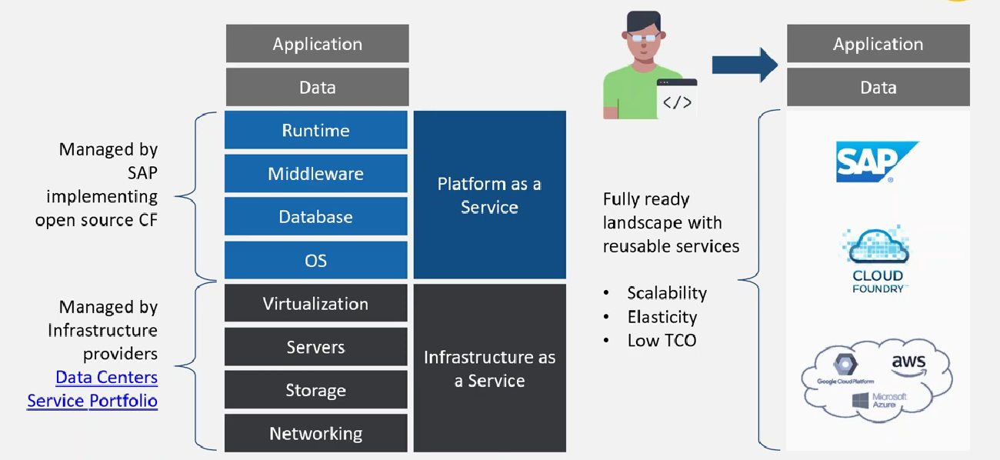

# 🟢 What is SAP BTP

* Using Infra as a service we can get Servers, Networking etc.
* Platforms as a service provides runtimes, database, OS
* SAP BTP is fully ready landscape with reusable service
  * Scalability ⇒ Horizontal / Vertical scaling
  * Elasticity ⇒ Any technology can be used
  * Low TCO
* Infra will be provided GCP, AWS, Azure
* On top of SAP BTP is provided as a service&#x20;
* <mark style="color:purple;background-color:purple;">**It can help develop applications without worrying the underlying platform required**</mark>
* <mark style="color:purple;background-color:purple;">**Developer just has to focus on application and data**</mark>
*

    <figure><figcaption></figcaption></figure>
