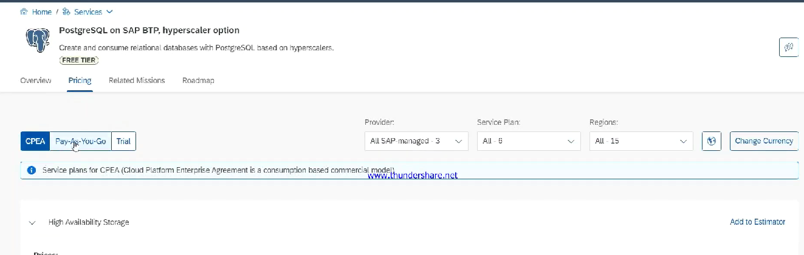

# 🟢 Backing Services

* <mark style="color:purple;background-color:purple;">**Provided out of the box by CF**</mark>
* <mark style="color:purple;background-color:purple;">**hana, postgre db, etc**</mark>
* Instance based services
* Each service has one or more service plans available
* <mark style="color:purple;background-color:purple;">**A service plan is the representation of the cost and benefits for a given variant of a particular service**</mark>
*

    <figure><figcaption></figcaption></figure>
