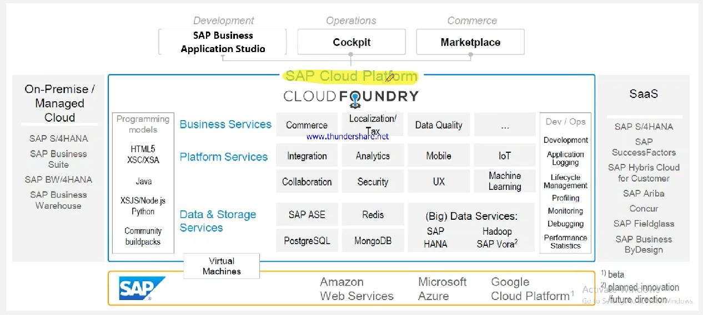

# Cloud Foundry

*   Open source Platform as a service

    <figure><figcaption></figcaption></figure>
* SAP used cloud foundry and on top of that it added features and gave it as BTP
* SAP BTP = SAP + Cloud Foundry + Infra&#x20;
*
