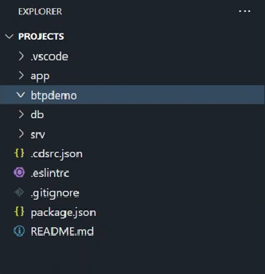
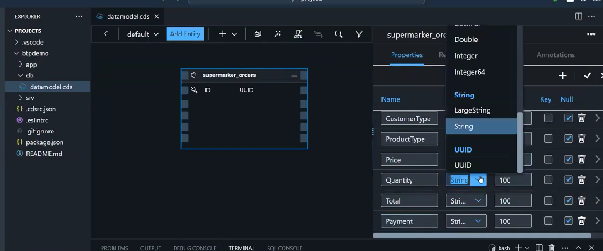
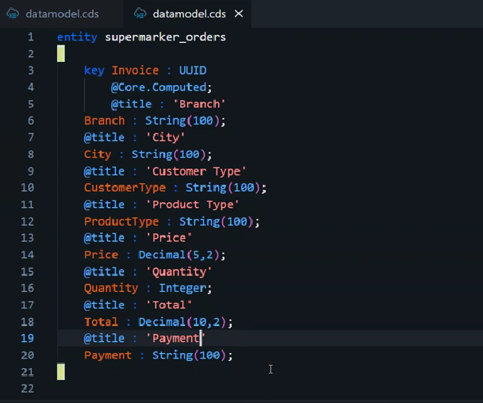
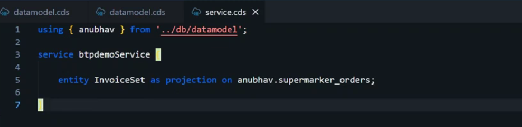
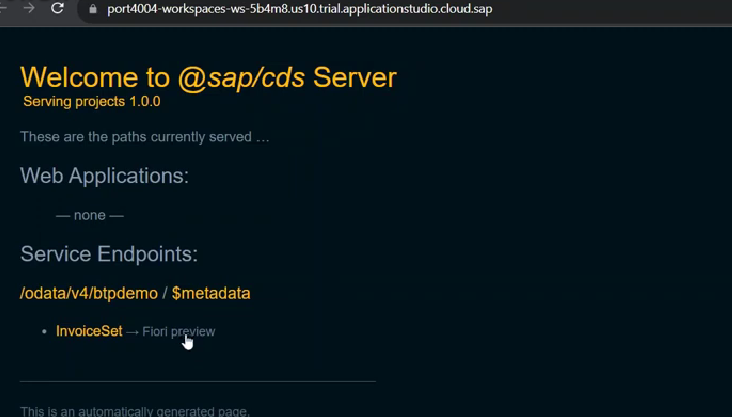

# ✈️ Demo BTP Application

* mkdir btpdemo ⇒ a new project is like a new folder
* cds init ⇒ Project structure will be created
  *

      <figure><figcaption></figcaption></figure>
* db ⇒ datamodel.cds
  * Right click and Open with Graphical Editor
  * Create entity ⇒ Which means a DB table
  * Inside this we can add fields
  *

      <figure><figcaption></figcaption></figure>
  * We can also do the same using text
    *

        <figure><figcaption></figcaption></figure>
* srv ⇒ Service.cds
  * Import the datamodel which was created
  *

      <figure><figcaption></figcaption></figure>
* db ⇒ csv ⇒ create a csv as the same as the entity which was created
* It will automatically upload all this data in the entity
* npm install
* cds deploy --to sqlite
* cds run
*   We can see all the data using the Fiori preview

    <figure><figcaption></figcaption></figure>
