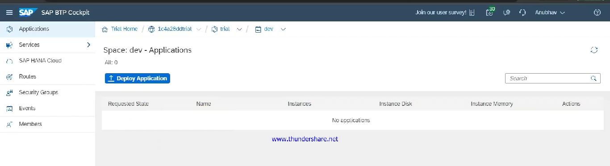
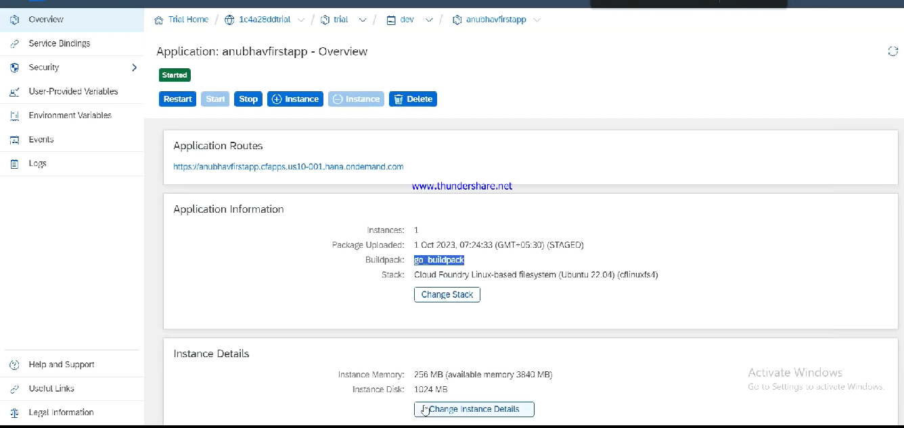

# 🟢 Deployment

* BTP ⇒ Sub Account ⇒ Dev Space
* We can all our apps here
*

    <figure><figcaption></figcaption></figure>
* In Project directory ⇒ create manifest.yml
  * It is deployment descriptor file
* cf login
* Select the space
* cd <\<project folder>>
* cf push
* In the Application, we can see all the details
*

    <figure><figcaption></figcaption></figure>
