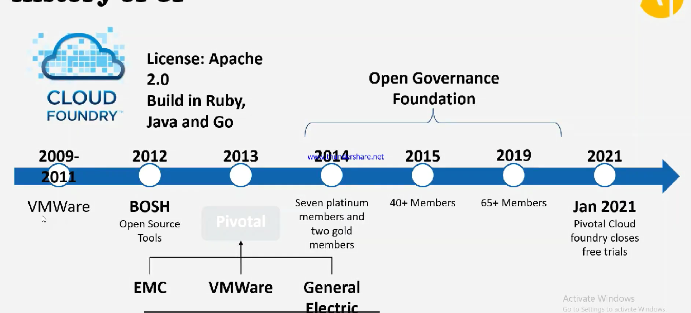

# ✈️ History of CF

* Pivotal came up with Cloud Foundry
* <mark style="color:purple;background-color:purple;">**In 2019 SAP commited to using Cloud foundry**</mark>
* <mark style="color:purple;background-color:purple;">**In 2021 SAP rebranded SAP Cloud Platform to SAP BTP**</mark>
* ESO2 is also similar to cloud foundry, but it did not grow
*

    <figure><figcaption></figcaption></figure>
