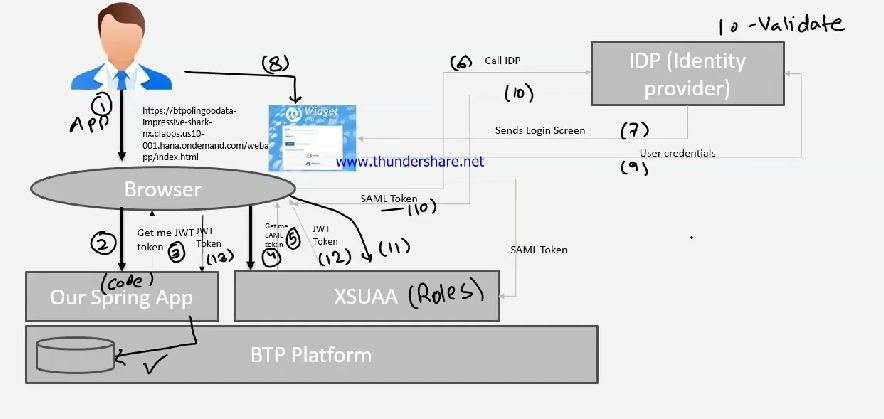

# 🟢 How it works behind the scenes

* When user tries to access the app, it will ask for JWT token
* <mark style="color:purple;background-color:purple;">**It will be redirected to xsuaa**</mark>
* <mark style="color:purple;background-color:purple;">**It will ask for SAML token**</mark>
* <mark style="color:purple;background-color:purple;">**It will be redirected to IDP**</mark>
* <mark style="color:purple;background-color:purple;">**Using login screen, user will login**</mark>
* <mark style="color:purple;background-color:purple;">**Once XSUAA gets SAML if will check if its authorized to use it, and then give jwt token**</mark>
*

    <figure><figcaption></figcaption></figure>
