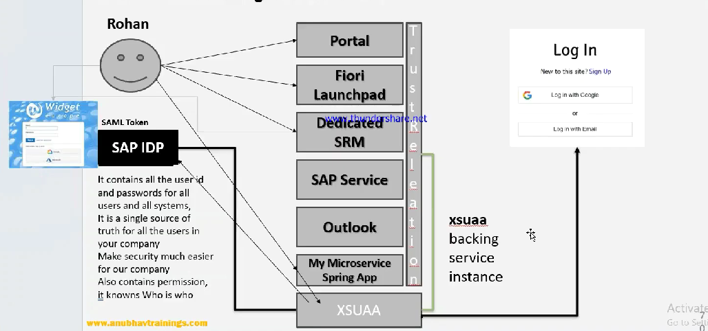

# IDP

* SSO:
  * corporate identity provider
  * Contains all the user id and password for all the user and all systems
* SSO has a trusted relationship with the systems
* SSO issues SAML token&#x20;
* Application validates token
* BTP uses SAP IDP, this can be configured to use other IDP also
* We need a backing service of xsuaa
*

    <figure><figcaption></figcaption></figure>
