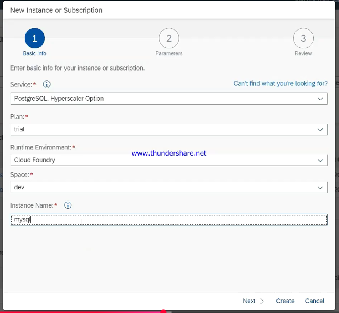
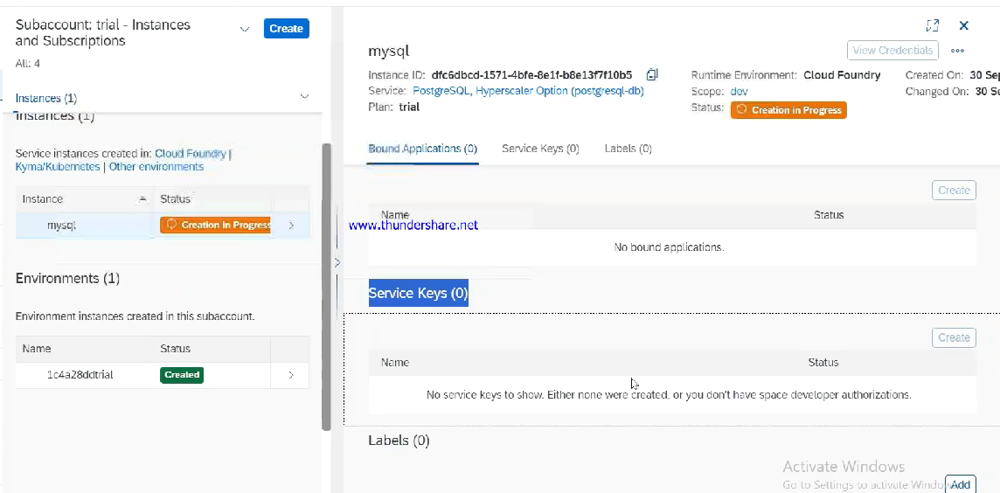

# 🟢 Instance based services

* Purest services
* <mark style="color:purple;background-color:purple;">**Specific functionality like database, connectivity, authentication**</mark>
* <mark style="color:purple;background-color:purple;">**We connect application to them**</mark>
* <mark style="color:purple;background-color:purple;">**No UI provided, they rely on API to connect to applications and other services and provide their services**</mark>
* <mark style="color:purple;background-color:purple;">**Provised inside an environment ⇒ Environment specific**</mark>
* <mark style="color:purple;background-color:purple;">**In cloud foundry ⇒ provisioned inside space**</mark>
* In Kyma ⇒ provisioned inside namespace
*   <mark style="color:purple;background-color:purple;">**Once instance is created, we can create a service key**</mark>

    <figure><figcaption></figcaption></figure>
*

    <figure><figcaption></figcaption></figure>
