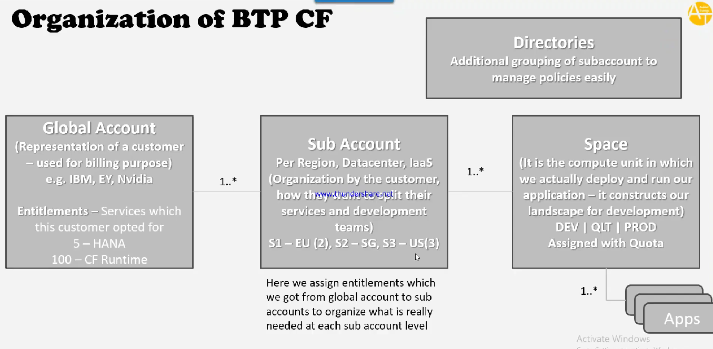

# 🟢 Organization of BTP CF

* <mark style="color:purple;background-color:purple;">**Global Account:**</mark>
  * <mark style="color:purple;background-color:purple;">Used for billing purpose</mark>
  * Representation of a customer
* <mark style="color:purple;background-color:purple;">**Entitlement:**</mark>
  * <mark style="color:purple;background-color:purple;">Services which the customer opted for</mark>
* <mark style="color:purple;background-color:purple;">**Sub Account:**</mark>
  * <mark style="color:purple;background-color:purple;">Organization by the customer how they want to split their services and development teams</mark>
  * Sub account - Europe Region
  * Sub account - HR Team
  * For sub account ⇒ we can select sub region, infra provider
* <mark style="color:purple;background-color:purple;">**Space:**</mark>
  * <mark style="color:purple;background-color:purple;">It is the compute unit in which we actually deploy and run our application</mark>
  * <mark style="color:purple;background-color:purple;">It constructs our landscape for development</mark>
  * <mark style="color:purple;background-color:purple;">Dev | Quality | Production</mark>
  * <mark style="color:purple;background-color:purple;">Space will be assigned with Quota on how much it can use</mark>
* <mark style="color:purple;background-color:purple;">**Application:**</mark>
  * <mark style="color:purple;background-color:purple;">Micro application will be deployed in space</mark>
* **Directories:**
  * Additional grouping of sub account to manage policies easily
* We do assign entitlement which we got from global to sub account to organize what is really needed at each sub account level
*

    <figure><figcaption></figcaption></figure>
