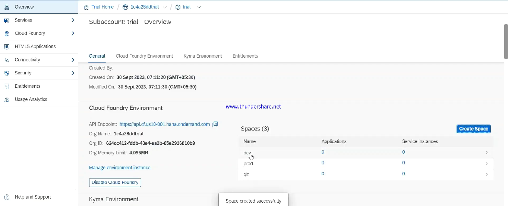

# 🟢 Space

* <mark style="color:purple;background-color:purple;">**We can create dev, quality, prod dev space**</mark>
* <mark style="color:purple;background-color:purple;">**Once space is created, then we do space Quota**</mark>
*   <mark style="color:purple;background-color:purple;">**Once space Quota is done, we do Quota Assignment**</mark>

    <figure><figcaption></figcaption></figure>
