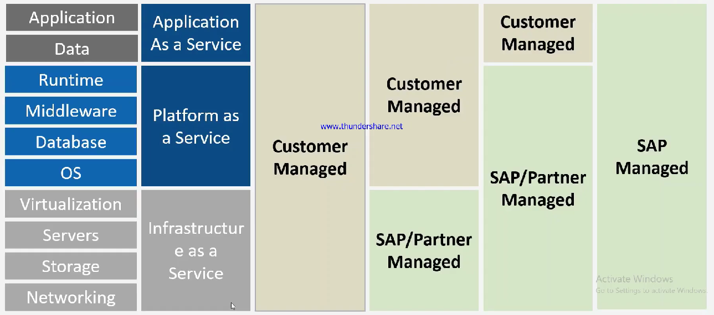

# Type of Cloud Offerings

* Infra as a service ⇒ Google, Azure, AWS
* Platform as a service ⇒ Runtime, Database, Middleware, OS
* Application as a service
* if a customer manages everything ⇒ On Premise&#x20;
* Infra given by SAP, Platforms and application managed by SAP
* Infra and Platform managed by SAP ⇒ SAP BTP
* If everything managed by SAP including by SAP like SAP datasphere, SAP analytics cloud then ⇒ SAP managed
*

    <figure><figcaption></figcaption></figure>
