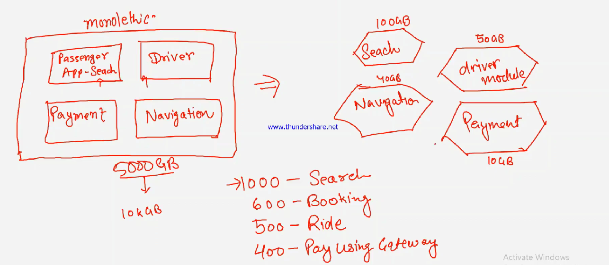

# Uber

* Used monolithic in 2003
* Converted to micro service in 2016&#x20;
  * Search&#x20;
  * Driver module
  * Navigation
  * Payment
* Different memory can be allocated to different components
*   <mark style="color:red;">**S4 Hana is monolithic**</mark>

    <figure><figcaption></figcaption></figure>
