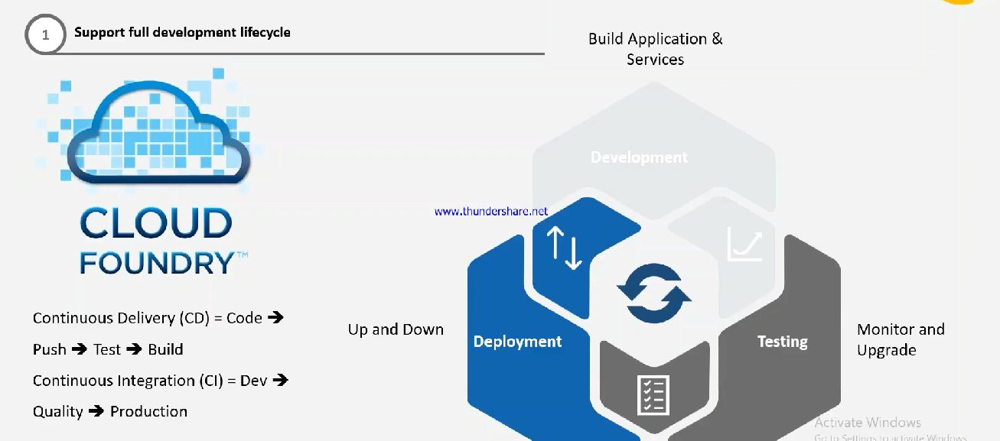

# Why Cloud Foundry

* Open Source
* Support full development lifecycle
* Development ⇒ Testing ⇒ Deployment
* CD ⇒ Code ⇒ Push ⇒ Test ⇒ Build
* CD ⇒ Dev ⇒ QA ⇒ Prod
*

    <figure><figcaption></figcaption></figure>
